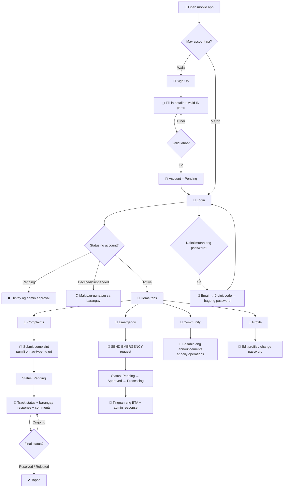
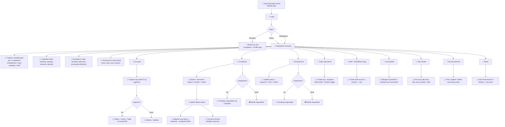
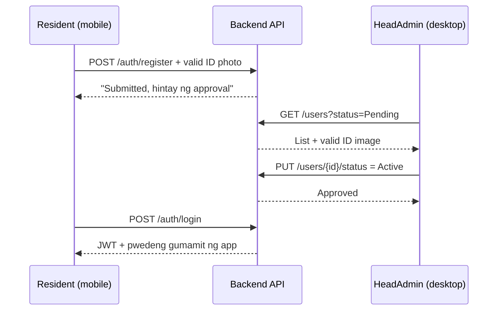
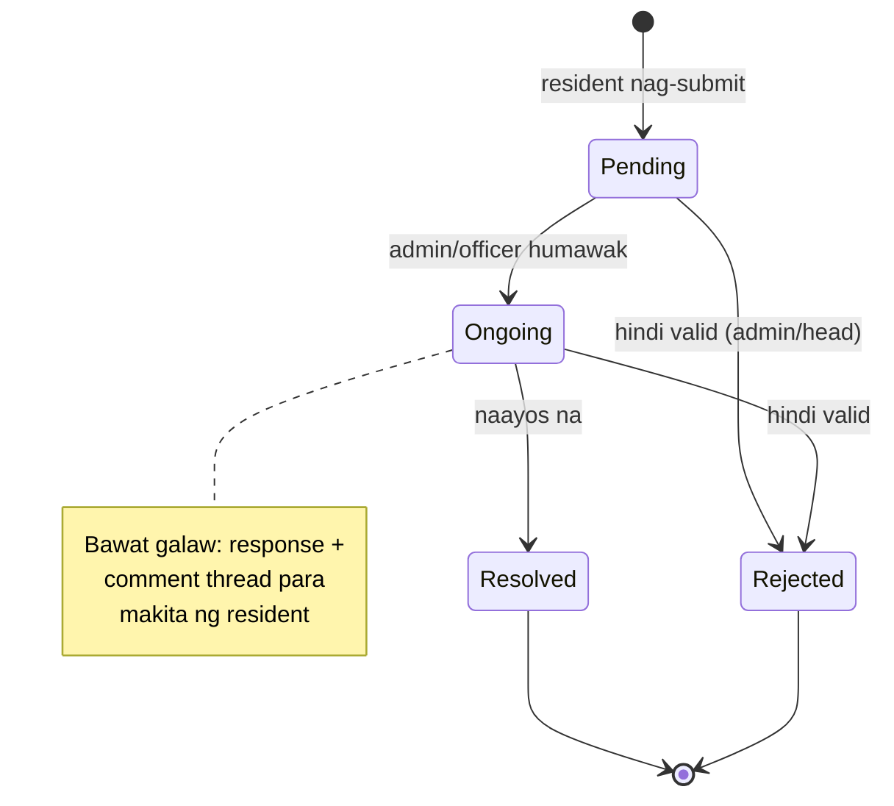

# System Flowcharts — Admin & User

> View this file on GitHub to see the diagrams rendered.
> Boxes with 🔷 are screens/pages; ◆ are decisions; ▢ are actions.

## 1. Resident / User flow (mobile app)

## 2. Admin flow (desktop app)

## 3. Account approval sequence (both sides meet here)

## 4. Complaint lifecycle (both sides meet here)

